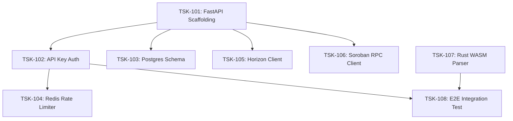

# Sprint 1 Backlog — QI-Guard for Stellar MVP

**Goal:** Deliver the Phase 0 Core Foundation — FastAPI API gateway, JWT/API Key auth system, PostgreSQL/Redis storage schemas, Horizon/Soroban RPC data connectors, and the Rust-based WASM disassembler module.  
**Timebox:** 2 Weeks (Weeks 1–2)  
**Pulled from:** [`PRODUCT_BACKLOG.md`](file:///home/kami/Desktop/codebase/QIGuard/PRODUCT_BACKLOG.md) items `B1.1`, `B1.2`, `B1.3`, `B1.4`, `B1.5`, `B1.6`.

---

## 1. Committed Sprint Tasks

| Task ID | Description | Source Story | Est. | Depends on | Status |
| :--- | :--- | :--- | :--- | :--- | :--- |
| **TSK-101** | Set up FastAPI application scaffolding, structure routes, middleware, and OpenAPI documentation endpoints. | `B1.1` | S | — | Ready |
| **TSK-102** | Implement API key generation and validation middleware (`qig_live_`, `qig_test_`, `qig_ci_`) with scope enforcement. | `B1.1` | M | TSK-101 | Ready |
| **TSK-103** | Create PostgreSQL database models (Projects, APIKeys, Contracts, Findings, Jobs) using SQLAlchemy/Alembic. | `B1.2` | M | TSK-101 | Ready |
| **TSK-104** | Configure Redis cache connection and implement tier-based sliding-window rate limiter (Developer, Builder, Protocol). | `B1.3` | M | TSK-102 | Ready |
| **TSK-105** | Build Stellar Horizon REST client with exponential backoff retry and account transaction pagination logic. | `B1.4` | L | TSK-101 | Ready |
| **TSK-106** | Build Soroban RPC client to retrieve deployed contract WASM bytecode binaries by contract ID. | `B1.5` | M | TSK-101 | Ready |
| **TSK-107** | Implement WASM disassembler in Rust (`wasmparser` + `pyo3` bindings) to extract opcodes and function signatures into Python dicts. | `B1.6` | L | — | Ready |
| **TSK-108** | Write end-to-end integration test verifying that a test API key can authorize a request to parse a sample WASM binary. | `B1.1`, `B1.6` | S | TSK-102, TSK-107 | Ready |

---

## 2. Sprint Acceptance Criteria & DoD

This sprint will be considered complete when all committed tasks meet the standards defined in [`DEFINITION_OF_DONE.md`](file:///home/kami/Desktop/codebase/QIGuard/DEFINITION_OF_DONE.md), specifically:

1. **API Key Generation & Verification:** Fast validation (< 5ms) of bearer tokens with scope checks.
2. **WASM Parser Functionality:** Successfully parses valid Soroban WASM samples without error, extracting instruction counts and exported function signatures.
3. **Horizon Ingestion:** Successfully queries Stellar testnet Horizon API for account transaction histories without unhandled rate-limit failures.
4. **Automated Testing:** `pytest` suite passes with > 85% branch coverage on auth, parser, and data connector modules.

---

## 3. Dependency & Risk Map for Sprint 1

